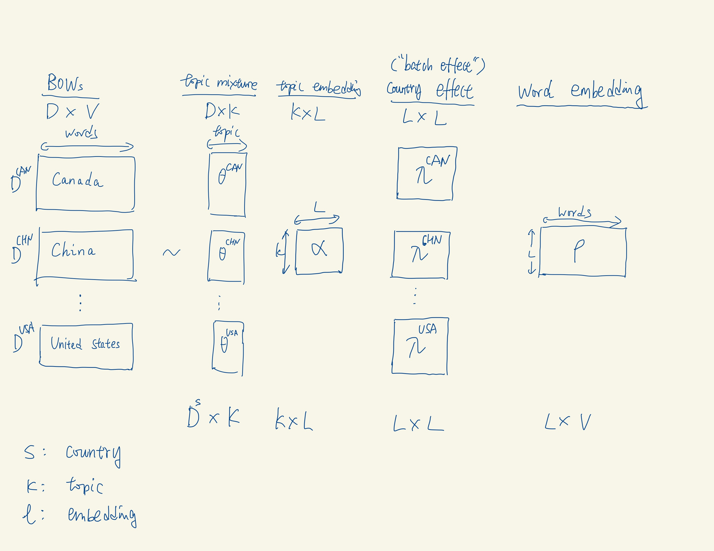

# Multi-modal Dynamic Embedded Topic Model



The code for preprocessing GPHIN dataset is in `scripts/data_gphin.py`. The default settings are configured for GPHIN dataset and in order to preprocess this datast, simply run the following command

``` python data_gphin.py```

This script assumes that the data is in a CSV format with a "country" column and a "SUMMARY" column.

The above script generates the bag-of-words representation of the data and stores it in `data/GPHIN/` directory.

After preprocessing, the ETM code can be run using the following command,

```python main.py --mode train --dataset "GPHIN" --data_path data/GPHIN --num_topics 10 --train_embeddings 1 --epochs 10```

or simply run ```./run.sh```. If running on Compute Canada, run ```./submit_job.sh```.

The above command is used to learn interpretable embeddings and topics together using ETM. The trained model is saved in `./results` directory.

To evaluate perplexity on document completion, topic coherence, topic diversity, and visualize the topics/embeddings run the following command,

```python main.py --mode eval --dataset "GPHIN" --data_path data/GPHIN --num_topics 10 --train_embeddings 1 --tc 1 --td 1 --load_from results/CKPT_PATH```
